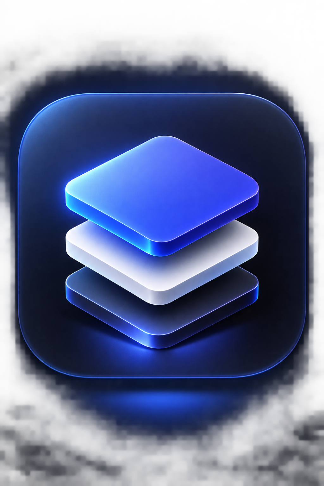

# InkPad

A lightweight, local-first Markdown reader and editor for Windows.

InkPad is a native Windows desktop application for reading and editing
Markdown files. It exists for the situations where opening a full IDE such as
VS Code just to read or make a small edit to a Markdown file is unnecessary.

- **Local-first** — your documents are files on your computer. InkPad reads and writes them directly.
- **Offline-friendly** — normal document work requires no Internet connection.
- **Lightweight** — a native desktop app built for one focused job.
- **Markdown-focused** — no project scaffolding, no workspace system, no plugin marketplace.
- **No accounts, no cloud, no telemetry** — nothing to sign up for, nothing watching.

## Why InkPad?

InkPad is intentionally small in scope. It is a Markdown reader and editor
for Windows — it is **not** an IDE, a project management system, a cloud
document platform, an AI workspace, or a collaboration suite. That is a
deliberate choice: a fast, focused tool that stays out of the way.

The project is open source so others can inspect it, learn from it, improve
it, fork it, and contribute improvements. Found something that can be better?
Contributions, fixes, and improvements are welcome.

## Features

- **Markdown Reader** — polished, readable rendering of Markdown documents
- **Markdown Editor** — CodeMirror 6 editing with syntax highlighting
- **Code block copying** — one-click copy for code blocks in the reader
- **Copy Markdown** — copy the full document source from the command palette
- **Tables** and **task lists** — rendered in the reader
- **Document outline** — headings list with quick navigation
- **Local images** — relative images in the document folder are loaded and displayed
- **Safe link handling** — links open in the system browser; document HTML is escaped, never executed
- **Search and replace** — in the editor (Ctrl+F / Ctrl+H)
- **Autosave** — documents are saved automatically
- **Recent files** — quick access to recently opened documents
- **Windows file associations** — open `.md` and `.txt` files with InkPad
- **Drag and drop** — drop a file onto the window to open it
- **Reading / Edit modes** — Ctrl+E toggles between rendered reading and editing
- **Split View** — editor and reader side by side (Ctrl+Shift+E)
- **Distraction-Free Mode** — focused, centered document view (Ctrl+Shift+F)
- **Command Palette** — Ctrl+K for quick access to commands
- **Quick File Switcher** — Ctrl+P to jump between recent files
- **Keyboard shortcuts** — most actions are one keypress away
- **Dark / light / system themes**
- **Configurable preferences** — reading width, reader and editor font sizes, word wrap, autosave
- **First-launch Welcome document** — an introduction on the first run
- **Single-instance behavior** — opening a file goes to the running instance
- **Native Windows application** — built with Tauri on the system WebView2 runtime

## Installation

### Installer

Download the latest Windows installer from
[GitHub Releases](https://github.com/mehul-27/InkPad/releases)
(`InkPad_1.0.0_x64-setup.exe` or `InkPad_1.0.0_x64_en-US.msi`).

### PowerShell

A one-command PowerShell installer may be added in a future release.

## Build from Source

Requirements:

- [Node.js](https://nodejs.org) (npm)
- [Rust](https://www.rust-lang.org) (stable toolchain)
- [Microsoft Edge WebView2 Runtime](https://developer.microsoft.com/en-us/microsoft-edge/webview2/) (usually preinstalled on Windows 10/11)
- [Microsoft C++ Build Tools](https://visualstudio.microsoft.com/visual-cpp-build-tools/) — the C++ toolchain required to compile the Rust project

```text
git clone https://github.com/mehul-27/InkPad.git
cd InkPad
npm install
npm run tauri dev
```

The difference between the npm scripts:

| Command | What it runs |
|---|---|
| `npm run dev` | Vite development server — frontend only, in the browser |
| `npm run tauri dev` | The native Tauri development application (frontend + Rust shell) |
| `npm run tauri build` | Production native build |

`npm run dev` starts a browser-based frontend development server. It is **not**
the desktop application. Use `npm run tauri dev` for the full app and
`npm run tauri build` for a production build.

Other useful commands:

```text
npm run check        # type-check the frontend (svelte-check)
npm run build        # build the frontend bundle (vite build)
```

## Keyboard Shortcuts

| Shortcut | Action |
|---|---|
| `Ctrl+E` | Toggle Reading / Edit mode |
| `Ctrl+Shift+E` | Toggle Split View |
| `Ctrl+Shift+F` | Toggle Distraction-Free Mode |
| `Ctrl+K` | Command Palette |
| `Ctrl+P` | Quick File Switcher |
| `Ctrl+O` | Open File |
| `Ctrl+S` / `Ctrl+Shift+S` | Save / Save As |
| `Ctrl+Shift+O` | Document Outline |
| `Ctrl+B` | Toggle Sidebar |
| `Ctrl+F` / `Ctrl+H` | Search / Replace (in the editor) |
| `Esc` | Close overlay / exit Distraction-Free Mode |

## Privacy and Local-First Design

InkPad is a local application. Your documents are plain files on your own
computer — InkPad reads and writes them directly, and normal document
functionality works without an Internet connection.

InkPad does not use:

- analytics or telemetry
- accounts
- cloud document storage
- advertising
- remote document processing

A future version may check for updates at startup only. That check is limited
to the update mechanism and does not affect normal offline document use.

## Technology

InkPad is built with:

- [Rust](https://www.rust-lang.org) — application shell
- [Tauri 2](https://tauri.app) — native desktop framework
- [Svelte 5](https://svelte.dev) — user interface
- [TypeScript](https://www.typescriptlang.org) — frontend logic
- [CodeMirror 6](https://codemirror.net) — text editing
- [markdown-it](https://github.com/markdown-it/markdown-it) — Markdown rendering
- [highlight.js](https://highlightjs.org) — code block highlighting
- [WebView2](https://developer.microsoft.com/en-us/microsoft-edge/webview2/) — the system webview on Windows

Tauri is used because it provides a native desktop shell while using the
system WebView2 runtime, so InkPad does not bundle a complete Chromium
runtime with the application.

## Contributing

Contributors are welcome. Open an issue or a pull request on
[GitHub](https://github.com/mehul-27/InkPad).

## License

InkPad is released under the [MIT License](LICENSE). You are free to use,
modify, and fork it, subject to the terms of that license.

## Acknowledgements

InkPad builds on the work of the open-source community:

- [Tauri](https://tauri.app)
- [Svelte](https://svelte.dev)
- [CodeMirror](https://codemirror.net)
- [markdown-it](https://github.com/markdown-it/markdown-it)
- [highlight.js](https://highlightjs.org)
- [IBM Plex Sans](https://github.com/IBM/plex)
- [JetBrains Mono](https://www.jetbrains.com/lp/mono/)
